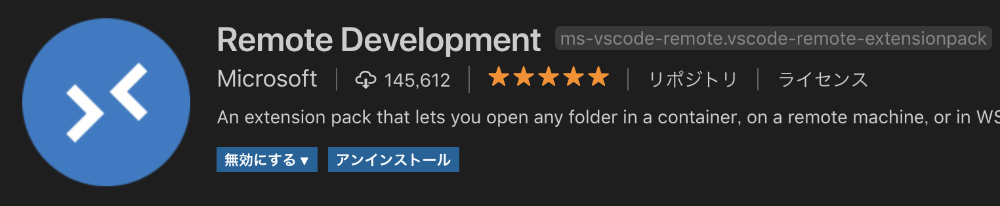
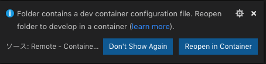
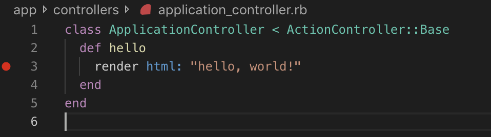
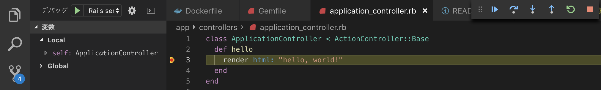

# Visual Studio Code Remoteを使用したRuby on Rails開発環境

## ●目的

開発に必要なツールのインストールや設定を自動化し、開発環境依存を無くす。

## ●使用ツール

|ツール名|バージョン|備考|
|:--|:--|:--|
|Visual Studio Code|1.35.1||
|Remote Development|-|VSCode拡張機能|
|Docker for Mac|2.0.0.3|UbuntuのDockerでも動作確認済み|

## ●使用方法

1. Visual Studio Codeをインストール　※自分のOSに合わせてインストールしてください
2. Remote Development拡張機能をインストール(VSCode拡張機能)



3. Dockerをインストール　※Macの場合はDocker for Mac  
※Linuxの場合は`sudo`しなくても使用できるように設定を行ってください。

4. 本リポジトリをクローン

```bash
git clone https://github.com/MasanoriIwakura/vscode-rails-remote.git
```

5. VSCode起動

```bash
code vscode-rails-remote
```

6. VSCode右下のダイアログから[Reopen in Container]を選択



コンテナイメージのインストールが実行される

7. ブレイクポイントの設定

下記イメージのようにブレイクポイントを設定する



8. [F5]キーを押下し、実行

9. ブラウザやcurlを使用して[http://localhost:3000]にアクセス



ブレイクポイントで止まります。